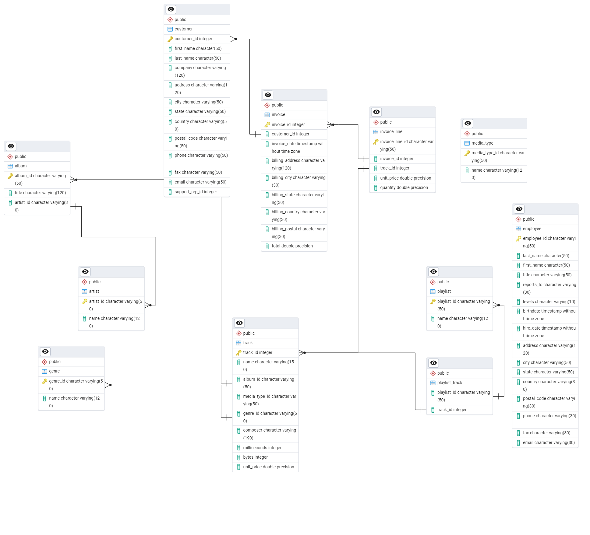

# MUSIC-STORE-DATA-ANALYSIS-USING-SQL
This project aims to analyze a music store’s database using SQL to uncover key insights about sales trends, customer behavior, popular tracks, and employee performance. By leveraging SQL queries, we extract meaningful data that helps in decision-making and business improvements.

## Key Objectives:
* Sales Analysis – Identify the top-selling tracks, albums, and genres.
* Customer Behavior – Analyze customer purchase patterns and spending habits.
* Revenue Insights – Track monthly and yearly revenue trends.
* Employee Performance – Evaluate sales performance of employees.
* Market Trends – Determine the most popular artists and genres across different regions.
* Geographic Analysis – Identify countries generating the highest revenue.

## Entity Relationship Digram

## Key insights
* Analyzed sales data to determine top countries with the most invoices, leading to targeted regional marketing strategies.
* Identified the best customers based on total spending, allowing for personalized customer engagement efforts.
* Determined top tracks and artists, aiding the promotion of popular music genres.
* Conducted an analysis of average track lengths to refine music playlist offerings.
* Analyzed spending patterns for customers on specific artists, which could influence artist promotions or product bundles.

## SQL Skills
* Advanced Data Aggregation: COUNT(), SUM(), AVG()
* Data Filtering & Sorting: WHERE, GROUP BY, ORDER BY, LIMIT CLAUSES
* JOIN Operations: INNER JOIN, LEFT JOIN, RIGHT JOIN
* Window Functions: ROW_NUMBER(), SUM(), AVG(), DENSE()
* Subquries and CTE
  

